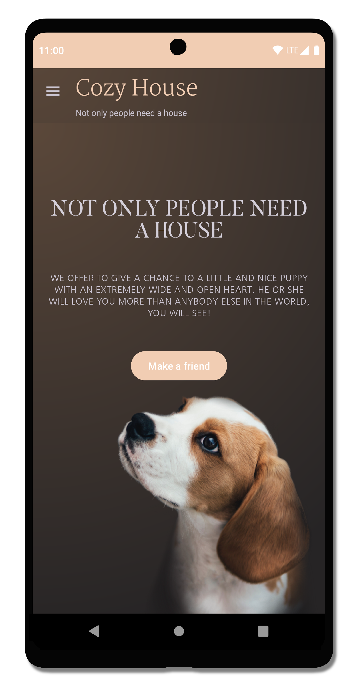
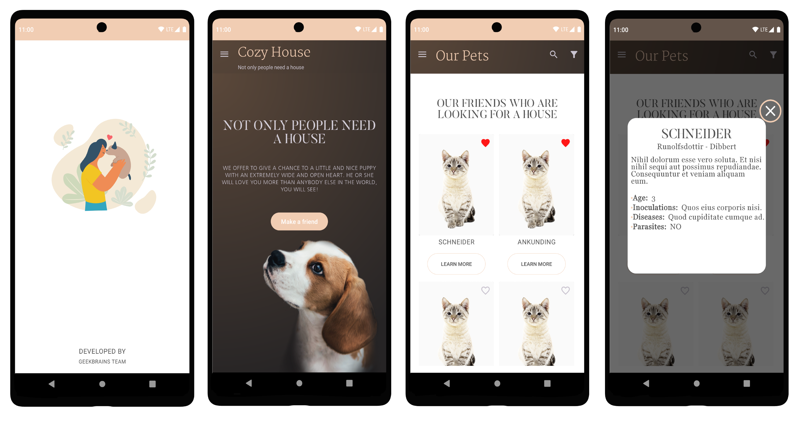
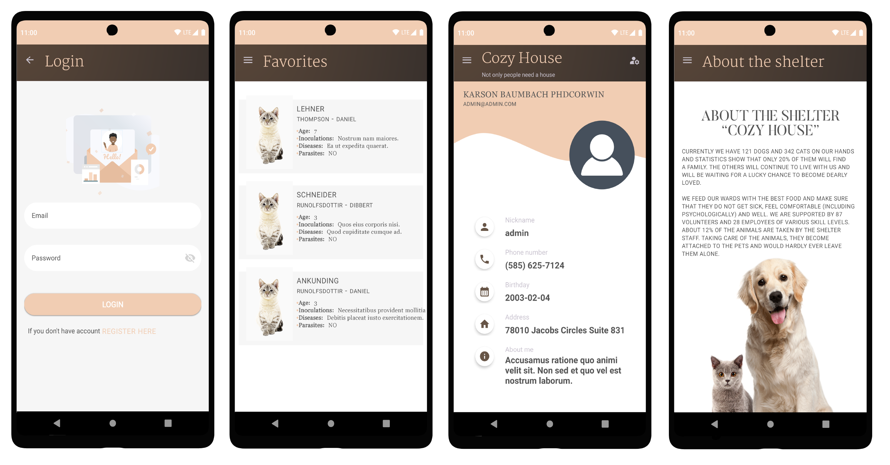

# Cozy House 🏡

Cozy House is an animal shelter app made as internship project for [GeekBrains](https://gb.ru) University.

App is using API data from [CozyHouse](https://shelter.tpyii.com).

[Github to CozyHouse site](https://github.com/tpyii/shelter-dom)

  

## Features 🦮

- Explore our pets and find your friend.
- Get detailed decription of all the pets.
- Get details about pet diseases, parasites and inoculation.
- Create a profile and add pet to the favorites.
- Search filters for pets.

## Built With 👷🏻

- [Kotlin](https://kotlinlang.org/) - First class and official programming language for Android development.
- [Android Architecture Components](https://developer.android.com/topic/libraries/architecture) - Collection of libraries that help you design robust, testable, and maintainable apps.
  - [LiveData](https://developer.android.com/topic/libraries/architecture/livedata) - Data objects that notify views when the underlying database changes.
  - [ViewModel](https://developer.android.com/topic/libraries/architecture/viewmodel) - Stores UI-related data that isn't destroyed on UI changes. 
  - [ViewBinding](https://developer.android.com/topic/libraries/view-binding) - Generates a binding class for each XML layout file present in that module and allows you to more easily write code that interacts with views.
  - [Paging 3](https://developer.android.com/topic/libraries/architecture/paging/v3-overview) - The Paging library helps you load and display pages of data from a larger dataset from local storage or over network. 
- [Moxy](https://github.com/Arello-Mobile/Moxy) - Library that helps to use MVP pattern
- [Cicerone](https://github.com/terrakok/Cicerone) -  Lightweight navigation library. 
- [Dagger 2](https://dagger.dev/) - Dependency Injection Framework
- [Retrofit](https://square.github.io/retrofit/) - A type-safe HTTP client for Android and Java.
- [RxJava](https://github.com/ReactiveX/RxJava) - Java VM implementation of Reactive Extensions
- [Material Components for Android](https://github.com/material-components/material-components-android) - Modular and customizable Material Design UI components for Android.
- [Lottie](https://github.com/airbnb/lottie-android) - Library that parses Adobe After Effects animations and renders them natively on mobile!

## Download 📥
- Download latest APK from [here](cozy-house.apk)

## Screenshots 📸

## Architecture 🏛

This project follows the MVP architecture with Moxy.

## Requirements 📱
- Android 6.0 and Above
- Min sdk version 23

## Permissions 💻
- Internet
- Phone

### Contributors 💼

### If you liked the project don't forget to star ⭐️ and fork 🍴  the project.

